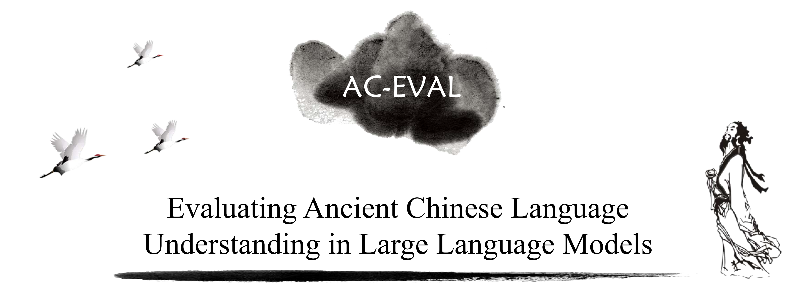
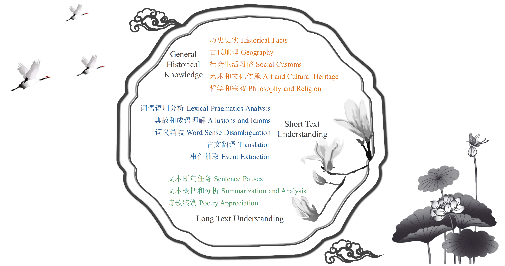

<p align="center">        </p>

<p align="center">
  ⏬ <a href="#data" target="_blank">数据</a> •   📃 <a href="http://arxiv.org/abs/2403.06574" target="_blank">论文</a>  •   🏆 <a href="https://github.com/yuting-wei/AC-EVAL/tree/main/#leaderboard" target="_blank">排行榜</a>  <br>  <a href="https://github.com/yuting-wei/AC-EVAL/tree/main/README_zh.md">   中文</a> | <a href="https://github.com/yuting-wei/AC-EVAL/tree/main/README.md">English 
</p>


AC-EVAL 提供了一个面向中国古代语言的大语言模型全面评估套件，涵盖了从先秦时期到清朝的各个时代。该数据集包括 3245 道多项选择题，覆盖了 3 个难度等级和 13 个不同的任务，如下所示。更多细节请查阅我们的[论文](http://arxiv.org/abs/2403.06574)。




我们的目标是评估和推进大语言模型在理解和处理古代汉语语言和知识方面能力。

## 排行榜
我们排行榜定期更新。下面展示了各种模型在answer-only (AO)和 chain-of-thought (COT)设置下的zero-shot和five-shot的准确率。细分结果可在[breakdown_results.xlsx](https://github.com/yuting-wei/AC-EVAL/tree/main/breakdown_results.xlsx)查看。

#### Zero-shot AO
| 模型          | 基础历史知识 | 短文本理解 | 长文本理解 | 平均值 |
|----------------|:------------------------------:|:--------------------------:|:-------------------------:|:---------:|
| ERNIE-Bot 4.0  | 77.54                        | 68.11                    | 66.42                   | 70.69   |
| GLM-4          | 76.63                        | 66.66                    | 67.70                   | 70.33   |
| Qwen-max       | 70.77                        | 64.88                    | 63.84                   | 67.50   |
| GLM-3-Turbo    | 75.21                        | 60.52                    | 59.77                   | 65.17   |
| Qwen-72B-Chat  | 71.25                        | 61.48                    | 59.80                   | 64.18   |
| Yi-34B-Chat    | 72.66                        | 61.33                    | 58.36                   | 64.12   |
| Qwen-14B-Chat  | 69.51                        | 56.53                    | 57.38                   | 61.14   |
| ERNIE-Bot      | 68.81                        | 57.80                    | 51.47                   | 59.36   |
| GPT-4          | 66.11                        | 55.11                    | 47.38                   | 56.20   |
| Qwen-7B-Chat   | 62.74                        | 48.76                    | 44.97                   | 52.16   |
| Yi-6B-Chat     | 60.70                        | 47.79                    | 39.49                   | 51.33   |
| Baichuan2-7B-Chat | 64.38                    | 46.77                    | 40.33                   | 50.49   |
| Baichuan2-13B-Chat | 65.57                    | 49.24                    | 35.40                   | 50.07   |
| ChatGLM3-6B    | 58.04                        | 43.01                    | 39.73                   | 46.93   |
| Xunzi-Qwen-Chat| 60.20                        | 44.31                    | 30.87                   | 45.13   |
| GPT-3.5 Turbo  | 53.50                        | 43.72                    | 36.94                   | 44.72   |
| LLaMA2-70B      | 33.55                        | 36.29                    | 30.72                   | 33.54   |


#### Five-shot AO
| 模型          | 基础历史知识 | 短文本理解 | 长文本理解 | 平均值 |
|------------------|:------------------------------:|:--------------------------:|:-------------------------:|:---------:|
| ERNIE-Bot 4.0    | 75.69                        | 69.59                    | 66.12                   | 70.47   |
| GLM-4            | 74.89                        | 65.48                    | 69.07                   | 69.81   |
| Qwen-max         | 75.29                        | 65.48                    | 66.99                   | 69.25   |
| GLM-3-Turbo      | 72.99                        | 59.48                    | 59.66                   | 64.04   |
| Qwen-72B-Chat    | 71.67                        | 61.30                    | 57.07                   | 63.35   |
| ERNIE-Bot        | 68.81                        | 57.62                    | 50.36                   | 58.93   |
| GPT-4            | 65.91                        | 58.07                    | 48.36                   | 57.45   |
| Qwen-14B-Chat    | 70.60                        | 53.73                    | 45.91                   | 56.75   |
| Yi-34B-Chat      | 66.62                        | 52.57                    | 41.90                   | 53.70   |
| Baichuan2-7B-Chat | 63.37                    | 45.91                    | 39.94                   | 49.74   |
| Baichuan2-13B-Chat | 63.75                    | 45.86                    | 32.74                   | 47.45   |
| Qwen-7B-Chat     | 61.42                        | 45.98                    | 30.78                   | 46.06   |
| ChatGLM3-6B      | 55.74                        | 42.92                    | 38.45                   | 45.71   |
| GPT-3.5 Turbo    | 53.99                        | 43.21                    | 36.40                   | 44.54   |
| Xunzi-Qwen-Chat  | 51.30                        | 41.25                    | 29.84                   | 40.80   |
| Yi-6B-Chat       | 55.76                        | 35.97                    | 28.48                   | 40.07   |


#### Zero-shot COT
| 模型          | 基础历史知识 | 短文本理解 | 长文本理解 | 平均值 |
|---------------|:------------------------------:|:--------------------------:|-------------------------:|---------:|
| Qwen-max      | 75.10                        | 66.72                    | 61.03                   | 67.62   |
| Qwen-72B-Chat | 74.79                        | 65.25                    | 56.78                   | 65.61   |
| Qwen-14B-Chat | 67.51                        | 54.64                    | 46.12                   | 56.09   |
| Qwen-7B-Chat  | 61.54                        | 44.97                    | 40.21                   | 48.91   |

#### Five-shot COT
| 模型          | 基础历史知识 | 短文本理解 | 长文本理解 | 平均值 |
|---------------|:------------------------------:|:--------------------------:|:-------------------------|:---------:|
| Qwen-max      | 74.30                        | 65.94                    | 61.46                   | 67.23   |
| Qwen-72B-Chat | 71.79                        | 61.62                    | 57.66                   | 63.69   |
| Qwen-14B-Chat | 67.49                        | 51.51                    | 39.93                   | 52.97   |
| Qwen-7B-Chat  | 59.37                        | 47.71                    | 35.36                   | 47.48   |


## 数据

#### 下载
* 方法一：下载zip压缩文件（您也可以直接用浏览器打开下面的链接）：
  ```
  wget https://huggingface.co/datasets/yuting-wei/aceval/resolve/main/aceval.zip
  ```
  然后可以使用 pandas加载数据：
  ```python
  import os
  import pandas as pd
  
  File_Dir="aceval"
  test_df=pd.read_csv(os.path.join(File_Dir,"test","art_and_cultural_heritage.csv"))
  ```

* 方法二：使用[Hugging Face datasets](https://huggingface.co/datasets/yuting-wei/aceval)直接加载数据集。示例如下：

  ```python
  from datasets import load_dataset

  dataset=load_dataset(r"yuting-wei/aceval",name="art_and_cultural_heritage")
  ```

#### 数据格式
为了方便使用，我们整理了13个主题对应的类别和中英文名称。详情请参考[subject_mapping.json](https://github.com/yuting-wei/AC-EVAL/tree/main/subject_mapping.json)。格式如下：
  ```
  {
      "art_and_cultural_heritage": {
        "English": "Art and Cultural Heritage",
        "Chinese": "艺术和文化遗产",
        "Supercategory": "General Historical Knowledge"
      },
      ...
      "filename":{
          "English": English Name,
          "Chinese": Chinese Name,
          "Supercatagory": Supercatagory Label (General Historical Knowledge/Short Text Understanding/Long Text Understanding)"
      }
  }
  ```
每个主题的数据集由两个部分组成：dev和test。每个主题的dev集由五个示例组成，并带有相应的答案解析。test集用于模型评估，其标签为非公开的，用户需要提交结果才能获得测试准确性。 [如何提交？](#how-to-submit)

下面是 艺术和文化传承 的dev集示例：
| 问题 | A | B | C | D | 答案 | 解析 |
|----------|---|---|---|---|--------|-------------|
| 五代南唐时期著名画家顾闳中的绘画名作是？|《女史箴图》 | 《五牛图》 | 《簪花仕女图》| 《韩熙载夜宴图》| D | 顾闳中的绘画名作是《韩熙载夜宴图》。《五牛图》是韩滉的作品，《簪花仕女图》是周昉的作品，《女史箴图》是顾恺之的作品。 |


## 如何在AC-EVAL上测试

我们使用正则表达式自动提取答案选项(A,B,C,D)，模型的评估代码位于[src](src)目录中。

我们使用了以下prompt进行测试：
#### 仅预测答案的prompt
##### Zero-shot AO
```
以下是中国古代{主题}领域的单项选择题，请直接给出正确答案对应的选项。

{测试题目}
A. {选项A}
B. {选项B}
C. {选项C}
D. {选项D}
答案：
```

##### Few-shot AO
```
以下是中国古代{主题}领域的单项选择题示例。在查看这些示例之后，请直接给出接下来一道题目的正确答案所对应的选项。

示例1：{题目1}
A. {选项A}
B. {选项B}
C. {选项C}
D. {选项D}
答案：A

[k-shot demo, note that k is 0 in the zero-shot case]

{测试题目}
A. {选项A}
B. {选项B}
C. {选项C}
D. {选项D}
答案：
```

#### 思维链prompt
##### Zero-shot COT
```
以下是中国古代{主题}领域的单项选择题，请逐步分析并给出正确答案对应的选项。

{测试题目}
A. {选项A}
B. {选项B}
C. {选项C}
D. {选项D}
答案：
```
##### Few-shot COT
```
以下是中国古代{主题}领域的单项选择题示例。在查看这些示例之后，请逐步分析接下来一道题目并给出正确答案所对应的选项。

示例1：{题目1}
A. {选项A}
B. {选项B}
C. {选项C}
D. {选项D}
答案解析：
让我们逐步分析。{解析过程}
所以答案是A。

[k-shot demo, note that k is 0 in the zero-shot case]

{测试题目}
A. {选项A}
B. {选项B}
C. {选项C}
D. {选项D}
答案：
```

## 如何

您首先需要准备一个 UTF-8 编码的 JSON 文件，并按照以下格式编写。详情请参考[submission_example.json](https://github.com/yuting-wei/AC-EVAL/tree/main/submission_example.json)。

  ```
  {
      "historical_facts": {
          "0": "A",
          "1": "B",
          "2": "B",
          ...
      },
      
      "subject_name":{
      "0":"ans_0",
      "1":"ans_1",
      ...
      }
      ....
  }
  ```
  然后，您可以将准备好的JSON文件提交到邮箱(yuting_wei@bupt.edu.cn)。请在电子邮件主题中使用以下其中一个文件标签来指明您进行的实验类型：[zero-shot-AO、few-shot-AO、zero-shot-COT、few-shot-COT]。

## TODO

- [x] 在`src`种添加评估代码
- [x] 添加模型的细分结果
- [x] 集成到Hugging Face数据集


## Licenses

[](https://lbesson.mit-license.org/)

本项目遵循[MIT License](https://lbesson.mit-license.org/).

[](http://creativecommons.org/licenses/by-nc-sa/4.0/)

AC-EVAL数据集遵循 [Creative Commons Attribution-NonCommercial-ShareAlike 4.0 International License](http://creativecommons.org/licenses/by-nc-sa/4.0/).


## 引用

如果您使用了我们的数据集，请引用我们的论文。
```
@inproceedings{wei-etal-2024-ac,
    title = "{AC}-{EVAL}: Evaluating {A}ncient {C}hinese Language Understanding in Large Language Models",
    author = "Wei, Yuting  and Xu, Yuanxing  and Wei, Xinru  and Yang, Simin  and Zhu, Yangfu  and Li, Yuqing  and Liu, Di  and Wu, Bin",
    booktitle = "Findings of the Association for Computational Linguistics: EMNLP 2024",
    year = "2024",
    publisher = "Association for Computational Linguistics",
    url = "https://aclanthology.org/2024.findings-emnlp.87",
    pages = "1600--1617",
}

```
## 致谢

本项目借鉴了[C-Eval](https://github.com/hkust-nlp/ceval)的整体结构。我们对其团队的辛勤工作以及对社区作出的重要贡献表示衷心的感谢。
